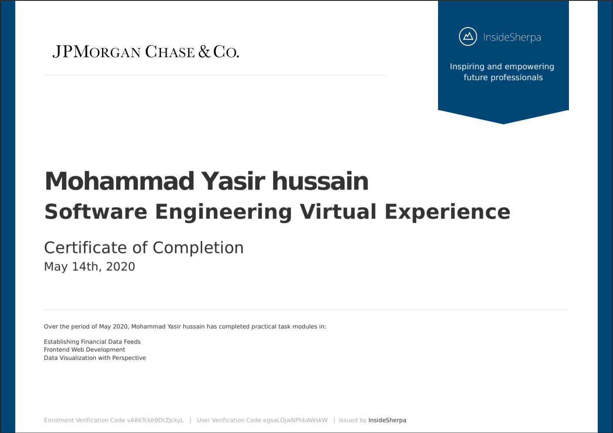

## JPMorgan-Chase-Virtual-Internship

This repository contains the submitted patch files of the various tasks assigned by JPMorgan Chase & Co. Software Engineering Virtual Internship.
Completed the following tasks:
```
➜ Interface with a stock price data feed and set up your system for analysis of the data

➜ Implemented the Perspective open source code in preparation for data visualization

➜ Used Perspective to create the chart for the trader’s dashboard
```

**Website Link:**
https://www.insidesherpa.com/virtual-internships/R5iK7HMxJGBgaSbvk

My Certificate of Completion


**For any queries/doubts:**
✉️ hussainyasir23@gmail.com 👍 
